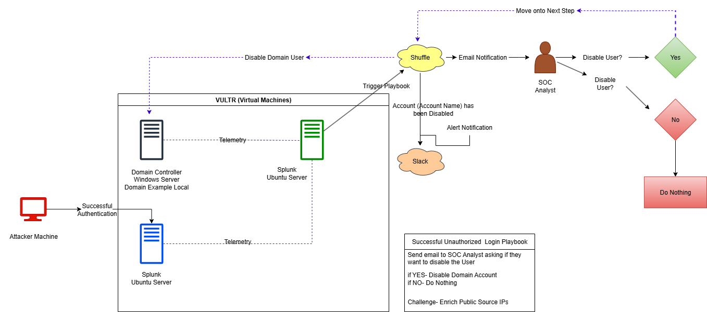

**Active Directory Detection & Response Lab (SOAR Integration)**

📝**Overview:**
This lab demonstrates the integration of Active Directory (AD) authentication logs into a SOAR workflow to automate security actions, such as disabling suspicious accounts. It simulates a real-world SOC environment where a SIEM detects specific Windows login events and triggers a SOAR playbook in response. The setup is designed to showcase how SIEM, AD, and SOAR tools can work together for efficient incident detection and automated response.

📌**Lab Sections:**
1. Requirements
2. Diagram
3. Architecture
4. Workflow
5. Hands-On Scenarios
6. Future Enhancements
7. Skills Practiced

⚙️**Requirements**

**Cloud & Infrastructure**

Vultr account (or equivalent cloud provider)

Windows Server 2022 ISO

Ubuntu 22.04 ISO

**Software & Tools**

Splunk (Enterprise trial)

Shuffle SOAR account

**Alerting & Communication**

Slack workspace for alerts

Email account for notifications

🖼️**Diagram**

  

**Description:**
This diagram illustrates the Active Directory Detection & Response Lab. It shows how authentication events from the Windows test server are sent to Splunk SIEM, which detects suspicious logins (Event ID 4624, Logon_Type=7) and triggers Shuffle SOAR playbooks. Depending on the analyst’s decision, SOAR can automate actions in Active Directory (e.g., disabling a user) and notify the SOC via Slack or email.

🏗️**Architecture**

**Components:**

1. Active Directory Domain Controller (Windows Server, IP: 149.23.151.133)

Hosts user accounts and manages authentication.

Receives SOAR commands (e.g., disable user).

2. Windows Test Server (IP: 201.147.112.42)

Domain-joined endpoint generating login events (Event ID 4624, Logon_Type=7).

3. Splunk SIEM (Ubuntu, IP: 45.72.31.163)

Collects Windows Event Logs via Universal Forwarder.

Detects suspicious logins using SPL: index="nifer-ad" EventCode=4624 (Logon_Type=7 OR Logon_Type=10)
Source_Network_Address=* Source_Network_Address!='-' Source_Network_Address!=40.* 
| stats count by _time,ComputerName,Source_Network_Address,user,Logon_Type

4. Shuffle SOAR (Ubuntu)

Receives webhook alerts from Splunk.

Executes playbooks to disable AD users or notify SOC via Slack/email.

5. Attacker Machine

Simulates unauthorized login attempts (RDP using CSmith account).

**Data Flow:**

1. AD generates authentication logs.

2. Logs are forwarded to Splunk SIEM.

3. Splunk runs a scheduled search to detect suspicious logins.

4. Splunk triggers a webhook alert to Shuffle SOAR.

5. Shuffle SOAR executes the playbook — disables user if approved and notifies the SOC.
