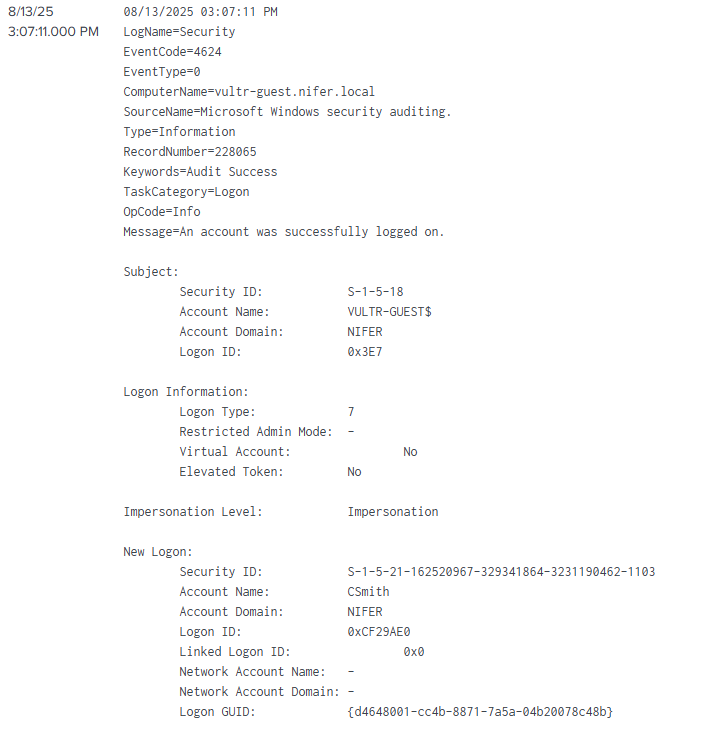
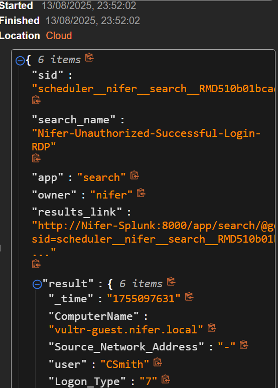
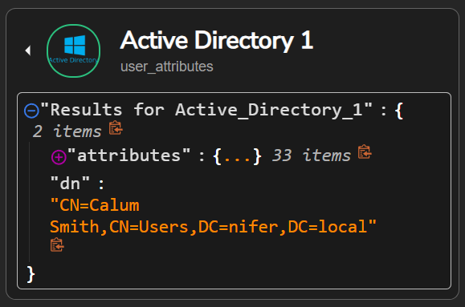
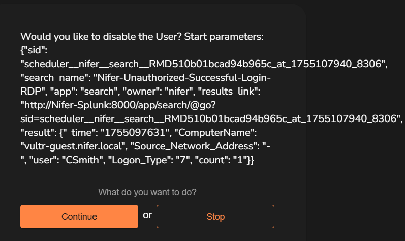
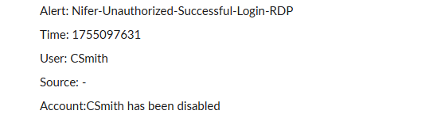
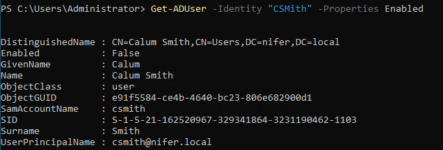

**Active Directory Detection & Response Lab (SOAR Integration)**

📝**Overview:**
This lab demonstrates the integration of Active Directory (AD) authentication logs into a SOAR workflow to automate security actions, such as disabling suspicious accounts. It simulates a real-world SOC environment where a SIEM detects specific Windows login events and triggers a SOAR playbook in response. The setup is designed to showcase how SIEM, AD, and SOAR tools can work together for efficient incident detection and automated response.

📌**Lab Sections:**
1. Requirements
2. Diagram
3. Architecture
4. Setup Instructions
5. Hands-On Scenarios
6. Future Enhancements
7. Skills Practiced

⚙️**Requirements**

**Cloud & Infrastructure**

Vultr account (or equivalent cloud provider)

Windows Server 2022 ISO

Ubuntu 22.04 ISO

**Software & Tools**

Splunk (Enterprise trial)

Shuffle SOAR account

**Alerting & Communication**

Slack workspace for alerts

Email account for notifications

🖼️**Diagram**

  

**Description:**
This diagram illustrates the Active Directory Detection & Response Lab. It shows how authentication events from the Windows test server are sent to Splunk SIEM, which detects suspicious logins (Event ID 4624, Logon_Type=7) and triggers Shuffle SOAR playbooks. Depending on the analyst’s decision, SOAR can automate actions in Active Directory (e.g., disabling a user) and notify the SOC via Slack or email.

🏗️**Architecture**

**Components:**

1. Active Directory Domain Controller (Windows Server, IP: 149.23.151.133)

  Hosts user accounts and manages authentication.

  Receives SOAR commands (e.g., disable user).

2. Windows Test Server (IP: 201.147.112.42)

  Domain-joined endpoint generating login events (Event ID 4624, Logon_Type=7).

3. Splunk SIEM (Ubuntu, IP: 45.72.31.163)

  Collects Windows Event Logs via Universal Forwarder.

  Detects suspicious logins using SPL: 

index="nifer-ad" EventCode=4624 (Logon_Type=7 OR Logon_Type=10)
Source_Network_Address=* Source_Network_Address!='-' Source_Network_Address!=40.* 
| stats count by _time,ComputerName,Source_Network_Address,user,Logon_Type

4. Shuffle SOAR (Ubuntu)

Receives webhook alerts from Splunk.

Executes playbooks to disable AD users or notify SOC via Slack/email.

5. Attacker Machine

Simulates unauthorized login attempts (RDP using CSmith account).

**Data Flow:**

1. AD generates authentication logs.

2. Logs are forwarded to Splunk SIEM.

3. Splunk runs a scheduled search to detect suspicious logins.

4. Splunk triggers a webhook alert to Shuffle SOAR.

5. Shuffle SOAR executes the playbook — disables user if approved and notifies the SOC.

**Note:** The IP addresses are placeholders.

🧰 **Setup Instructions**

1. **Lab Environment Setup**

Create Vultr Instances. Open a Vultr account and provision three instances with the following specifications:

| Instance              | vCPUs | RAM     | Storage    | OS                           | Purpose                                      |
| --------------------- | ----- | ------- | ---------- | ---------------------------- | -------------------------------------------- |
| AD Machine            | 2     | 4096 MB | 80 GB SSD  | Windows Server 2022 Standard | Domain Controller, hosts user accounts       |
| Test Machine          | 1     | 2048 MB | 55 GB SSD  | Windows Server 2022 Standard | Domain-joined endpoint for login simulations |
| Splunk + Shuffle SOAR | 4     | 8192 MB | 160 GB SSD | Ubuntu 22.04 x64             | SIEM and SOAR platform                       |

**Configure Networking**

Set up the VPC network to ensure all instances can communicate securely.

Configure firewall rules to allow necessary ports:

RDP for Windows instances (port 3389)

SSH for Ubuntu (port 22)

Splunk web interface (default port 8000)

Shuffle SOAR web interface and API ports 

**2. Active Directory Setup**

**Configure Domain Controller**

Set up the AD machine as a Domain Controller for the domain nifer.local.

Create a test user account (e.g., CSmith).

**Join Test Machine to Domain**

Add the Windows Test Machine to the nifer.local domain.

Authenticate using the CSmith account to verify domain membership.

**Enable Remote Desktop for Test User**

Configure Remote Desktop (RDP) access on the Test Machine.

Add CSmith to the Remote Desktop Users group or authorized users list.

Test RDP login using the CSmith account to ensure access is working.

**3. Splunk SIEM Setup**

**Install Splunk Enterprise**

Install and configure Splunk Enterprise on the Ubuntu server.

**Forward Windows Logs**

Install the Splunk Universal Forwarder on both the Windows Test Server and the AD Domain Controller.

Configure them to forward security/event logs to the Splunk instance.

**Create Splunk Alert** 

Set up a scheduled search to detect suspicious logins:

Event ID: 4624

Logon_Type: 7 (remote interactive) or 10 (remote desktop/console)

Configure the alert to trigger when matching events occur.

**4. Shuffle SOAR & Slack Integration**

Create accounts for Shuffle SOAR and Slack.

Connect Splunk’s webhook to Shuffle SOAR to trigger automation workflows.

In Slack, create a workspace and channel (e.g., #alerts), and retrieve the Channel ID.

Authenticate the Shuffle SOAR Bot with Slack.

Build a workflow that:

Detects Event ID 4624 (Logon_Type 7/10) from Splunk alerts.

Sends a Slack alert for suspicious login activity.

Sends an email to the analyst with an approval link to authorize or deny account disablement.

If approved, queries Active Directory via LDAP to locate the targeted account.

Disables the account in Active Directory.

Sends a final confirmation alert to Slack once the account has been disabled.

💻 **Hands-On Scenarios**

Incident Response Workflow – Unauthorized Login Containment

Step 1 – Detection (Splunk Alert)

Splunk detects a successful Windows logon (Event ID 4624) from the test server.

Step 2 – Alert Forwarding (SOAR Webhook)

Splunk forwards the event to Shuffle SOAR via webhook for automated triage.

Step 3 – Automated Investigation (Playbook Execution)

Shuffle queries Active Directory for the affected account and triggers an approval workflow for the SOC analyst.

Step 4 – Analyst Decision (Email Approval Workflow)

SOC analyst receives an email with action links (Approve/Deny) to authorize account disablement.

Step 5 – Response Notification (Slack Update)

Slack posts an alert in the SOC channel summarizing the login event, the analyst’s decision, and containment status.

Step 6 – Containment Confirmation (Active Directory)

Active Directory confirms the account has been disabled following analyst approval

